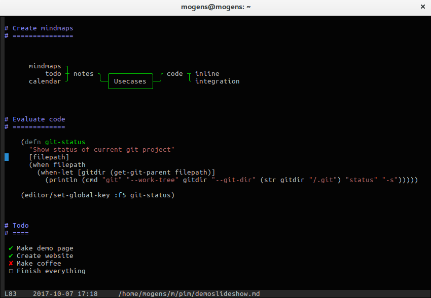

# Salza &lambda;iquid text editor
[](https://clojars.org/mogenslund/liquid)

Salza &lambda;iquid text editor is designed with clojure developers in mind.

The editor is written in pure Clojure. That is, there are no other dependencies, not even curses!

I have been using Emacs for many years. I have tweaked it a lot and implemented modes, to simulate the Vim way of switching between insert mode and normal mode for navigation. I like being able to use the whole keyboard for navigation. As you will see in the video below, I am very inspired by Emacs and Vim, but I have choosen not to try to copy or reimplement Emacs or Vim. I have only stolen the features that I need or like. I hope others will just create plugins or extensions to make the editor support other features that they like.



I could tell a lot about the editor, but I think you should see the video below for a demonstration.

## Demo video
Watch this video to get a sense of how the editor works: [liquid01](https://drive.google.com/file/d/0B5Au3PxHCmgBM2MySHl4aUVWTEE/view?usp=sharing)

## Technical video explaining the core datastructure of the editor
This video is for technical minded people to get a view of the inside of the construction of the editor. Useful for understanding the idea behind the editor or as inspiration for similar projects or extensions of this: [slider01](https://drive.google.com/file/d/0B5Au3PxHCmgBNjJodzNjQ2w4c2M/view?usp=sharing)

## Use cases
 * <b>Tight integration</b> with Clojure code. It should be easy to have the same code executed from within the editor as well as outside. Using a real language for extensions provides a great advantage compared to a "home made" extension language, that only fits the specific editor.  
Example: As a QA Engineer I do test automation using Selenium WebDriver. I have included the Selenium jar into my local environment, so now I can execute tests, parts of tests or snippets from within &lambda;iquid.  
All other tools that I create in Clojure, which are useful as is, are easy to make accessible from within the editor as well.

 * <b>Embedding</b> the editor into your your application. Include the &lambda;iquid to your project and use it as part of your program or for debugging and patching, just like you already do with the REPL, but with some advantages: It is easier to open a file with code and execute parts of it, or jump between snippets, do modifications, and execute again.  
Example: I have a file with snippets like: `(patch "myserver")`, `(status "myserver")` and `(run-test "name-of-test")`. I just modify "myserver", if needed, and press "e" to execute the command.

## Future visions

 * <b>Port to ClojureScript</b> Since there are no other dependencies than Clojure itself and not much Java Interop, I don't think it would be that hard, to port parts of the editor to ClojureScript, if there is a use case for that.

## Status of the application
**The program is not production ready yet**

Most of the basic features I want are in place, but needs to be described further and polished (like checking for unsaved buffers on exit etc.)

The extension system also needs to mature, with best practices and well-defined integration points. I may still have to do changes to some basic structures to accommodate this.

Some pieces, like syntax highlighting, are hardcoded. I did that, to have some syntax highlighting available, while completing the editor. It needs to be refactured and modulized, so customized syntax highlighting will be easier to do.

## Installation

### Download and execution
**Notice:** The editor will only work on Linux and Mac at the moment. In later versions support for Windows will be implemented.

Download [liquid-0.6.1.jar](https://github.com/mogenslund/liquid/releases/download/v0.6.1/liquid-0.6.1.jar)
Also download clojure-1.8.0.jar from [clojure.org](http://clojure.org/community/downloads)

Execute the program with:

    java -cp clojure-1.8.0.jar:liquid-0.6.1.jar clojure.main -m dk.salza.liq.core

To run as webserver use:

    java -cp clojure-1.8.0.jar:liquid-0.6.1.jar clojure.main -m dk.salza.liq.core --server --port=8520

and access using:

    http://localhost:8520

For running in terminal and as serve at the same time use:

    java -cp clojure-1.8.0.jar:liquid-0.6.1.jar clojure.main -m dk.salza.liq.core --web --port=8520

Use --autoupdate for making multiple browser automatically sync content. (For collaborative editing.)


#### Known bugs
No known bugs at the moment.

### Leiningen
Clone the github project and execute the command below to generate a jar file

    lein uberjar

or just to run

    lein run

## Dependencies
Right now the only dependency is Clojure itself. I would like to keep it that way, as for core functionality. When starting Liquid, any resources can just be added to the classpath, and the code will be available from inside Liquid. So it is not a limitation to Liquid, it just means that anything requiring other dependencies should be implemented as plugins and be loaded together with Liquid. Extensions can be loaded through a .liq file in the home folder.

## Inspiration from Emacs and Vi
From Emacs I have been inspired by extensibility. Clojure is also the language for writing extensions. That was in fact a primary motivation for creating the editor. Actually it is possible to include the editor into a project and make the editor part of the program. This thought is very similar to the REPL (read-eval-print-loop), but more like an edit-eval-render-loop.

From Vi I have stolen the concept of normal/insert mode. I really like the ability to use the whole keyboard to navigate the file and execute commands at one time, while typing text in another. The tab key is used to switch between the two modes. The color of the cursor will indicate which mode is in use. I have resisted the attempt to use the same keybindings as Vi. Some are the same, but as default I have chosen the keys jkli as navigation keys. They are located where the fingers are placed and layed out like the arrow keys. Look at jkli on the keyboard. Different up and down operations are mapped to different combinations with "i" and "k" (up and down), while different sideway actions are mapped to "j" and "l". E.g going to the end of the line is done with shift+l and the beginning of the line with shift+j.

S-expressions in clojure can be evaluated with "e", while the whole file is evaluated with shift+e.

Extending the functionality is done by including the classpath to the wanted code, when starting &lambda;iquid and using the .liq file to require the code or remap keys to use the new code or whatever code that needs to run to integrate the code into the editor..

## Usage

### Basic keymappings
Keymappings are dependend of the mode in which the buffer is in.
In plainmode, which is the default mode for regular text, clojure code and markdown, the most central key is TAB:

TAB switches between two keymappings, one for navigation and common commands and one for typing text. (Very similar to vim, but with some differences.)
Notices that the cursor changes between blue for navigation and green for insert.

When in insertmode most keys just print the character pressed.

Use *C-g* to try to escape from a state.
Use *C-q* to quit editor.

#### Navigation (blue cursor)
      C-space: Start command mode (Typeahead to switch buffer, select and do stuff. See ?????????)
      l:   Right
      j:   Left
      i:   Up
      k:   Down
      space: Page down
      m:   Switch to previous buffer (Usefull for swithing forth and back between two buffers)
      o:   Other window (Move between main and prompt windows)
      O:   Context action (If the cursor is on a filepath or name Liquid will try to open that file. If it is a function, Liquid will try to navigate to the definition.)
      C-s: Search
      n:   Next search result

(Notice it is like cursor keys without moving your hand.)

      J:   Beginning of line
      L:   End of line
      w:   Forward word
      gg:  Beginning of buffer
      G:   End of buffer

#### Delete and Insert
      x:   Delete char
      Backspace: Delete backward
      yy:  Copy line or selection
      pp:  Paste on new line
      ph:  Paste
      dd:  Delete line or selection
      o:   Insert line
      r:   Replace with next char pressed
      I:   Move line up
      K:   Move line down
      v:   Begin or cancel selection

#### Filehandling
      s:   Save file
      C-f: Open file

#### Clojure code
      C-e: Evaluate current file without capturing output (for (re)-loading internal stuff)
      E:   Evaluate current file
      e:   Evaluate current s-expression
      1:   Select current s-expression (Multiple presses will make the cursor switch between begin and end parenthesis.)

#### Macro recording
      H:   Start and stop recording
      h:   Play recording

## Sample .liq file
Modify the content below and save it to .liq in your home directory:

```clojure
(ns user
  (:require [clojure.string :as str]
            [dk.salza.liq.editor :as editor]
            [dk.salza.liq.mode :as mode])
  (:use [dk.salza.liq.tools.cshell]))

(editor/add-searchpath "/tmp")              ; Files below /tmp will now be chooseable from the Ctrl+Space chooser
(editor/add-snippet "Something to insert.") ; This snippet will be available from the Ctrl+Space chooser
(editor/add-file "/tmp/tmp.clj")            ; Open /tmp/tmp.clj for editing
(editor/add-file (str (System/getProperty "user.home") ".liq")) ; Open .liq file for editing
```

## Options
It is not working yet, but at some time the argument "--jframe" should start a JFrame implementation of the view.

## License
Copyright &copy; 2016 Mogens Br&oslash;dsgaard Lund

Distributed under the Eclipse Public License either version 1.0 or any later version.