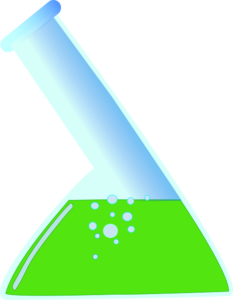

# Salza &lambda;iquid text editor

   

* <b>Fluidable</b>  -  Embed your code into &lambda;iquid or &lambda;iquid into your code   
* <b>Dependency free</b>  -  Everything is pure Clojure
* <b>Translatable</b>  -  Tiny core, simple model, no tricks
* <b>Comfortable keybindings</b>  -  Most used commands are close at hand

       

## Who is this for
&lambda;iquid is absolutely not for everyone! It is for you if

 * You get a kick out of doing everything in Clojure
 * You love to tinker with your editor
 * Terminals are the best
 * You love distraction-free power
 * You love modal editing, like in vim

## What can you do with it
There is no made up language or syntax to extend &lambda;iquid.

 * Since &lambda;iquid is pure Clojure it can be used to extend any Clojure or Java program, so the editor lives inside the program.. like magic.
 * Turn it around, you can use any Clojure and any Java library to extend &lambda;iquid.. if the library can do it then &lambda;iquid can do it. Configure keyboard shortcuts and commands to tame the libraries. Use code to integrate.

# Video
[Authors Liquid Setup](https://www.youtube.com/watch?v=-MC0P4rj3e8)

## Community
For discussions, help, tips and support, use

**[#liquid](https://clojurians.slack.com/messages/liquid/)** channel in [Clojure Slack](http://clojurians.net/)

## Installation

### Download and execution

#### Quick start

    clojure -Sdeps '{:deps {mogenslund/liquid {:mvn/version "2.1.2"}}}' -m liq.core

Or download jar [liq.jar](https://salza.dk/liq.jar) and execute

    java -jar liq.jar

#### Disappearing cursor
If the cursor seems to disappear when moving fast, try executing this code when loading liquid (e.g in the .liq file):

    (swap! liq.tty-output/settings assoc :liq.tty-output/cursor-draw-hack true)

(It is not enabled by default, because it then sometimes cause other display issues.)
  
#### Starter kit
A place to start is [Liquid Starter Kit](https://github.com/mogenslund/liquid-starter-kit)

It sort of corresponds to a sample `.emacs` file. Some code you can extend to create your own version of the editor.

#### Salza &lambda;iquid text editor is designed with clojure developers in mind
The editor is written in pure Clojure. That is, there are no other dependencies, not even curses or lanterna!

I have been using Emacs for many years. I have tweaked it a lot and implemented modes, to simulate the Vim way of switching between insert mode and normal mode for navigation. I like being able to use the whole keyboard for navigation. As you will see in the video below, I am very inspired by Emacs and Vim, but I have chosen not to try to copy or re-implement Emacs or Vim. I have only stolen the features that I need or like. I hope others will just create plugins or extensions to make the editor support other features that they like.

## Use cases
 * <b>Tight integration</b> with Clojure code. It should be easy to have the same code executed from within the editor as well as outside. Using a real language for extensions provides a great advantage compared to a "home made" extension language, that only fits the specific editor.  
Example: As a QA Engineer I do test automation using Selenium WebDriver. I have included the Selenium jar into my local environment, so now I can execute tests, parts of tests or snippets from within &lambda;iquid.  
All other tools that I create in Clojure, which are useful as is, are easy to make accessible from within the editor as well.

 * <b>Embedding</b> the editor into your your application. Include the &lambda;iquid to your project and use it as part of your program or for debugging and patching, just like you already do with the REPL, but with some advantages: It is easier to open a file with code and execute parts of it, or jump between snippets, do modifications, and execute again.  
Example: I have a file with snippets like: `(patch "myserver")`, `(status "myserver")` and `(run-test "name-of-test")`. I just modify "myserver", if needed, and press "c p p" to execute the command.

## Dependencies
Right now the only dependency is Clojure itself. I would like to keep it that way, as for core functionality. When starting &lambda;iquid, any resources can just be added to the classpath, and the code will be available from inside &lambda;iquid. So it is not a limitation to &lambda;iquid, it just means that anything requiring other dependencies should be implemented as plugins and be loaded together with &lambda;iquid. Extensions can be loaded through a .liq file in the home folder.

## Inspiration from Emacs and Vi
From Emacs I have been inspired by extensibility. Clojure is also the language for writing extensions. That was in fact a primary motivation for creating the editor. Actually it is possible to include the editor into a project and make the editor part of the program. This thought is very similar to the REPL (read-eval-print-loop), but more like an edit-eval-render-loop.

S-expressions in clojure can be evaluated with "c p p", while the whole file is evaluated with "c p f".

## License
Copyright &copy; 2020 Mogens Br&oslash;dsgaard Lund

Distributed under the Eclipse Public License either version 1.0 or any later version.
